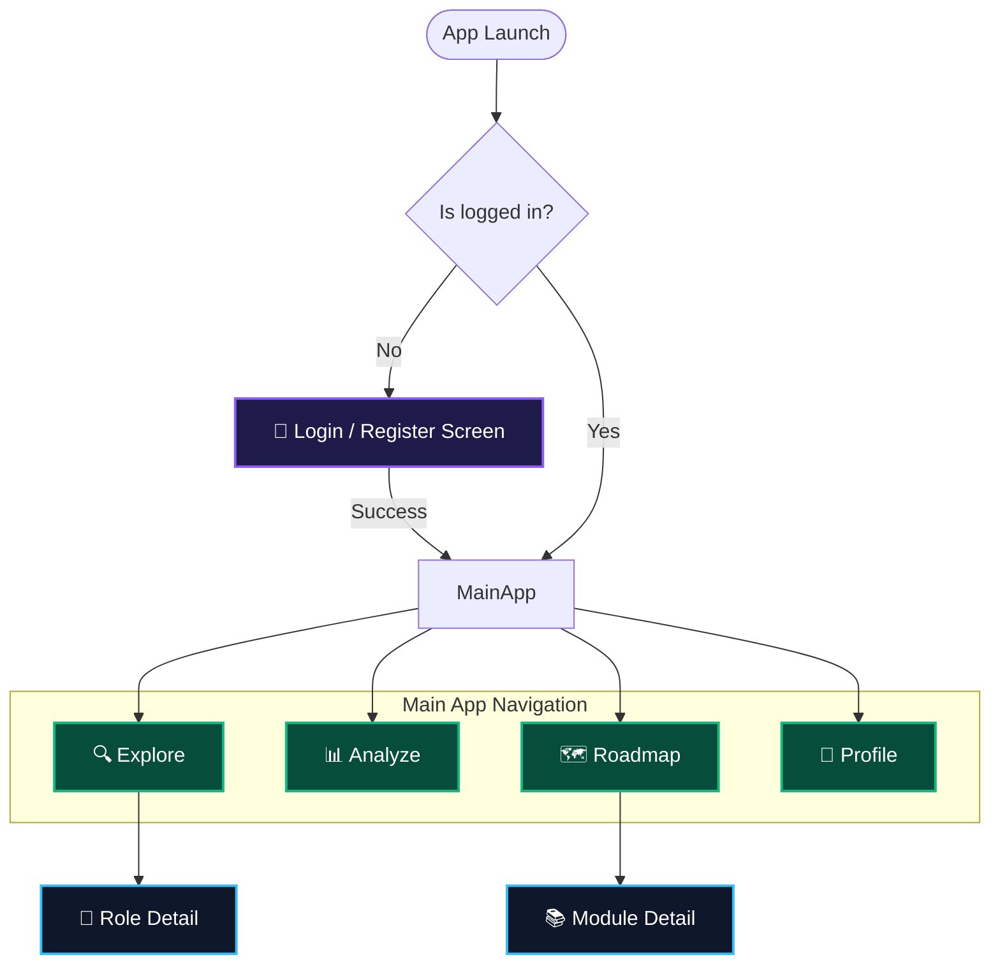

The core of SkillSync is built on a clean, maintainable architecture powered by `provider` for state management. Below is the application's screen flow:



---

## 🚀 Technical Challenges & Learnings
Building this application provided deep insights into mobile architecture and AI integration:
- **Consistent AI Outputs:** Engineered complex LLM prompts using Groq to ensure structured, predictable JSON outputs for dynamic UI generation.
- **Real-Time Data Streams:** Mastered complex stream integrations with Firebase to ensure the UI instantly reflects database updates without manual refreshing.
- **Advanced Flutter UI:** Implemented performant glassmorphism and custom animation charts, proving the capability of Flutter's rendering engine.

---

## 🛠 Getting Started

### Prerequisites
- **Flutter SDK** (Latest Stable)
- **Firebase Project** (Auth + Firestore enabled)
- **Groq API Key**

### Installation

1. **Clone Repository**
   ```bash
   git clone https://github.com/YOUR_USERNAME/skillsync.git
   cd skillsync
   ```

2. **Install Dependencies**
   ```bash
   flutter pub get
   ```

3. **Setup Environment Variables**
   Create a `.env` file in the root directory. *This file is ignored by git to protect your keys.*
   ```env
   GROQ_API_KEY=your_api_key_here
   ```

4. **Run the App**
   ```bash
   flutter run
   ```

---

## 🔒 Security Practices
- **Zero Hardcoded Secrets:** API keys are injected safely using `.env` or `--dart-define`.
- **Protected Database:** Utilizes Firebase Security Rules to restrict unauthorized reads/writes.
- **Clean Architecture:** No leaked print statements with Personally Identifiable Information (PII) in production builds.

---

## 👨‍💻 Author

**Abhinand Krishna R**  
* 🌐 **Portfolio / Website**: [Insert Your Page Link Here](#)
* 💼 **LinkedIn**: [Insert Your LinkedIn Here](#)
* 🐱 **GitHub**: [@Abhinand-krishna-R](https://github.com/Abhinand-krishna-R)
