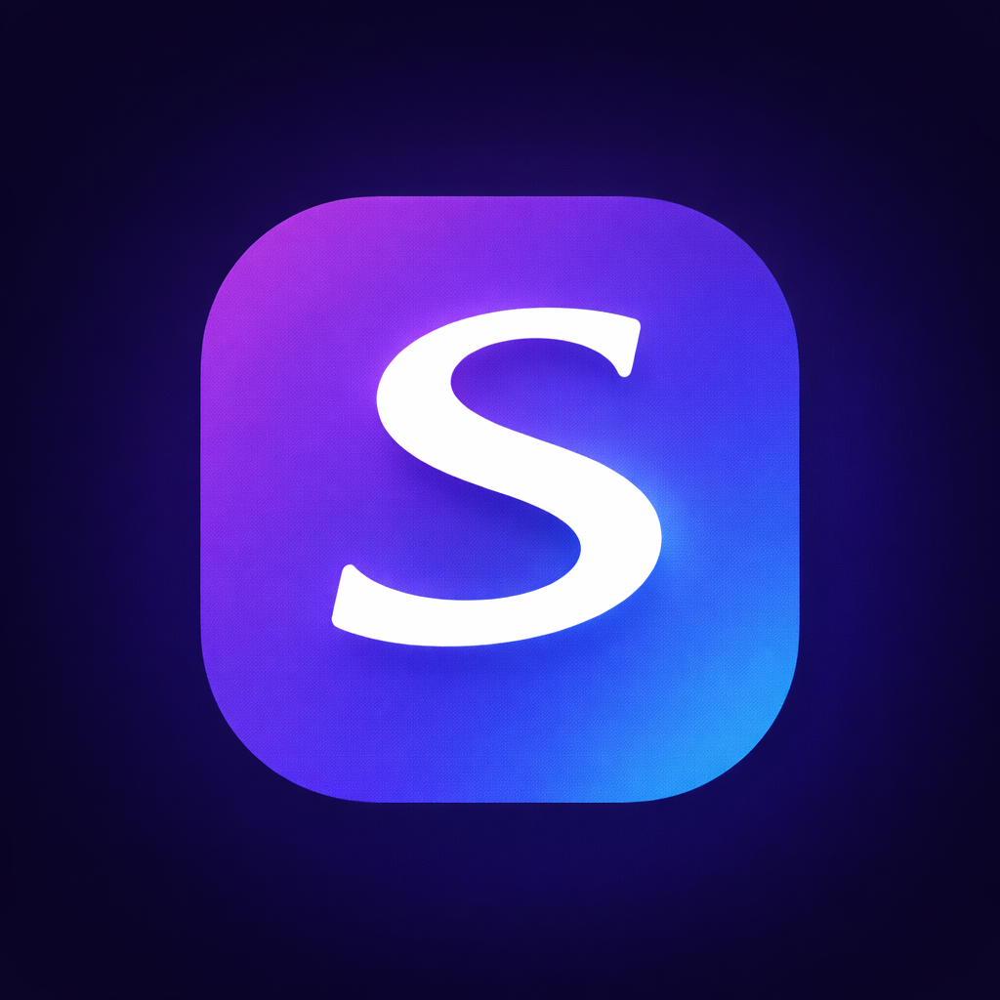
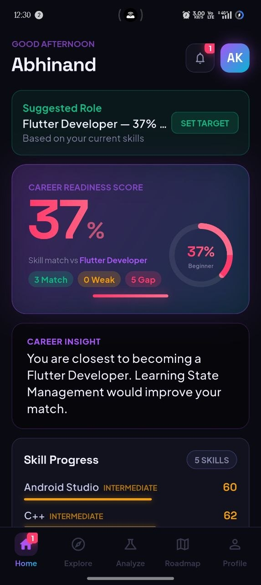
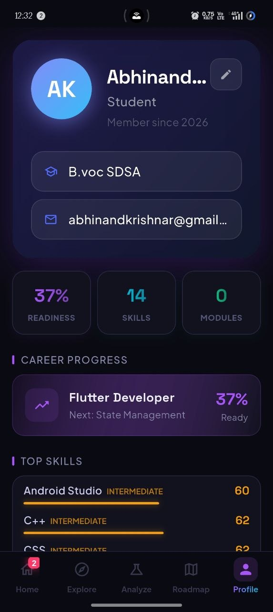
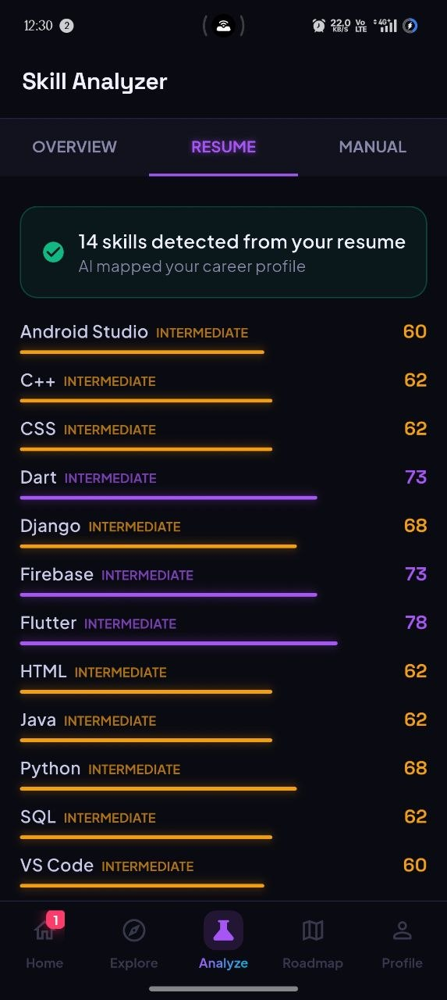
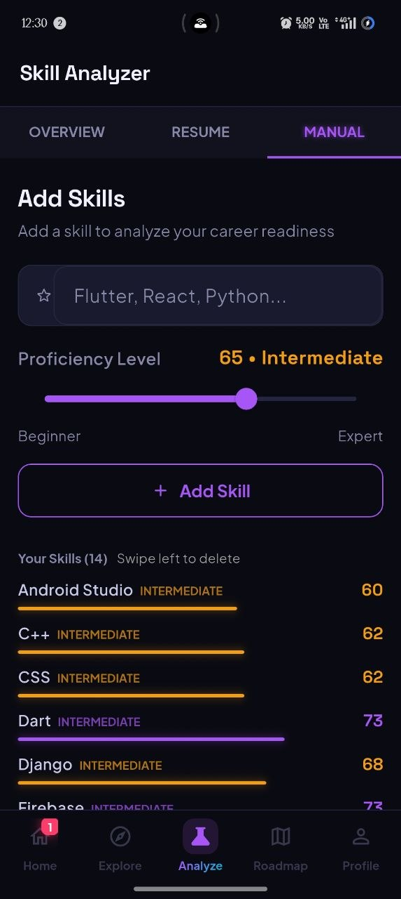
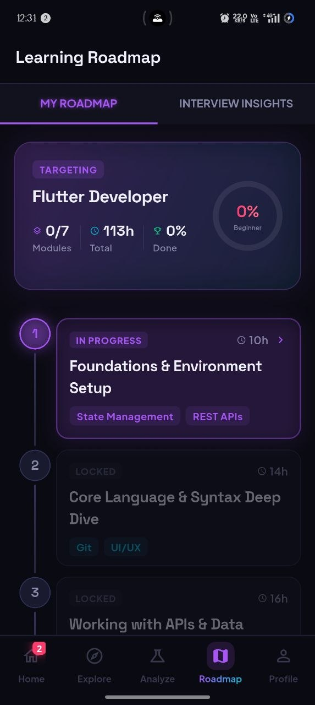
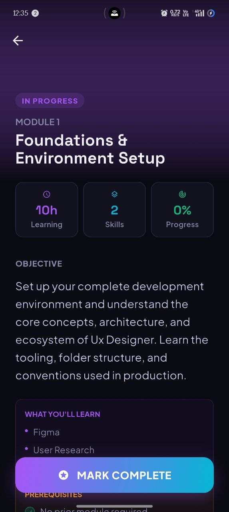
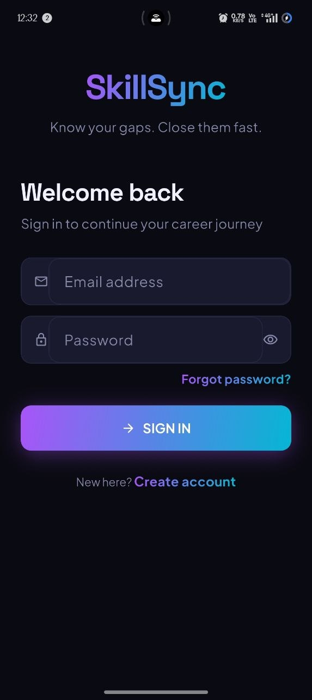
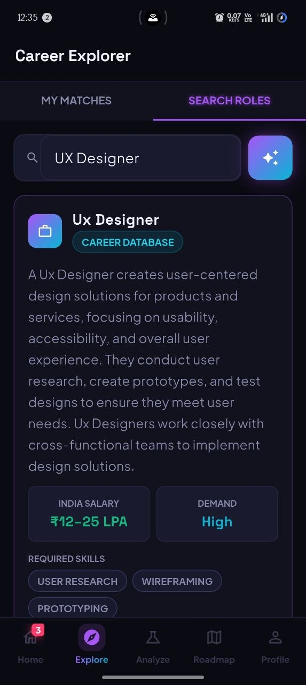

<div align="center">

# 🚀 SkillSync

**AI Career Intelligence & Skill Gap Analyzer**

*Turn your skills into a clear career path using AI-powered analysis, real-time scoring, and personalized learning roadmaps.*



[](https://flutter.dev/)
[](https://firebase.google.com/)
[](https://groq.com/)
[](https://dart.dev/)

</div>

---

## 🌟 Overview
**SkillSync** is a production-ready Flutter application designed to help users navigate their careers. By integrating **Groq’s high-speed LLMs** with Firebase, the app delivers real-time skill insights, calculates dynamic career readiness scores, and generates structured, module-based learning roadmaps.

## 💼 Why This Project Matters
Many early-career professionals and developers struggle to understand the specific skills required for their target roles. SkillSync solves this by:
- **Translating Vague Goals:** Converting abstract career ambitions into concrete, structured learning paths.
- **AI-Driven Gap Analysis:** Instantly identifying missing skills based on real-world role requirements.
- **Actionable Tracking:** Helping users track their readiness dynamically, bridging the gap between learning and employability.

---

## ✨ Key Features
- **🤖 AI-Powered Skill Analysis:** Understand your strengths and weaknesses instantly using advanced LLMs.
- **🎯 Personalized Career Roadmaps:** Get a personalized 7-step learning module tailored specifically to your target role.
- **📊 Readiness Scoring System:** Visual progress tracking and matching percentage for your dream job.
- **💡 Smart Role Suggestions:** The AI suggests the best-fitting career paths based on your current skill profile.
- **✨ Premium UI/UX:** A stunning, modern dark theme utilizing custom glassmorphism, dynamic gradients, and smooth micro-animations.
- **🔐 Secure & Synced:** Complete Firebase authentication and real-time Firestore database synchronization across devices.

---

## 📸 Screenshots

### 🏠 Dashboard & Profile
| Readiness Score (Home) | User Profile |
|---------------|----------|
|  |  |

### 📊 AI Skill Analysis
| Resume Parsing | Manual Skill Entry |
|---------------|----------|
|  |  |

### 🗺️ Dynamic Learning Path
| Roadmap Generator | Module Details |
|--------|--------|
|  |  |

### 🔐 Authentication & Onboarding
| Secure Login | Career Explorer |
|--------|--------|
|  |  |

---

## 🧠 Application Architecture

The core of SkillSync is built on a clean, maintainable architecture powered by `provider` for state management. Below is the application's screen flow:


---

## 🚀 Technical Challenges & Learnings
Building this application provided deep insights into mobile architecture and AI integration:
- **Consistent AI Outputs:** Engineered complex LLM prompts using Groq to ensure structured, predictable JSON outputs for dynamic UI generation.
- **Real-Time Data Streams:** Mastered complex stream integrations with Firebase to ensure the UI instantly reflects database updates without manual refreshing.
- **Advanced Flutter UI:** Implemented performant glassmorphism and custom animation charts, proving the capability of Flutter's rendering engine.

---

## 🛠 Getting Started

### Prerequisites
- **Flutter SDK** (Latest Stable)
- **Firebase Project** (Auth + Firestore enabled)
- **Groq API Key**

### Installation

1. **Clone Repository**
   ```bash
   git clone https://github.com/YOUR_USERNAME/skillsync.git
   cd skillsync
   ```

2. **Install Dependencies**
   ```bash
   flutter pub get
   ```

3. **Setup Environment Variables**
   Create a `.env` file in the root directory. *This file is ignored by git to protect your keys.*
   ```env
   GROQ_API_KEY=your_api_key_here
   ```

4. **Run the App**
   ```bash
   flutter run
   ```

---

## 🔒 Security Practices
- **Zero Hardcoded Secrets:** API keys are injected safely using `.env` or `--dart-define`.
- **Protected Database:** Utilizes Firebase Security Rules to restrict unauthorized reads/writes.
- **Clean Architecture:** No leaked print statements with Personally Identifiable Information (PII) in production builds.

---

## 👨‍💻 Author

**Abhinand Krishna R**  


